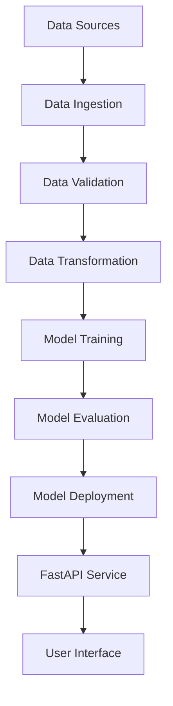

<div align="center">

# 🧪 Food Adulteration Detection System 🧪

[](https://fastapi.tiangolo.com/)
[](https://www.python.org/)
[](https://www.docker.com/)
[](https://scikit-learn.org/)
[](https://www.tensorflow.org/)
[](LICENSE)

*An end-to-end machine learning system for detecting and analyzing food adulteration risks*

</div>

## 🔍 Project Overview

The **Food Adulteration Detection System** is a comprehensive data science and machine learning platform designed to identify, analyze, and predict health risks associated with food product adulteration. This system combines state-of-the-art machine learning techniques with a modern web API to provide real-time analysis and prediction capabilities.

The project implements a complete MLOps workflow including data ingestion, validation, transformation, model training, evaluation, and deployment - all wrapped in a user-friendly FastAPI interface for seamless interaction.

## ✨ Key Features

- 🤖 **Advanced ML Models**: Utilizes ensemble learning techniques to predict adulteration risks
- 🔄 **End-to-End Pipelines**: Automated workflows from data ingestion to prediction
- 🌐 **Modern API**: FastAPI-powered interface with automatic OpenAPI documentation
- 📊 **Interactive UI**: Clean, responsive web interface for submitting samples and viewing results
- 🐳 **Containerization**: Docker support for consistent deployment across environments
- 🧪 **Comprehensive Testing**: Pytest-based test suite with coverage reporting
- 📝 **Detailed Logging**: Structured logging for monitoring and debugging

## 🏗️ Project Architecture



## 📂 Project Structure

```
.
├── 📁 .github/                      # GitHub Actions workflows
├── 📁 .git/                         # Git repository
├── 📁 artifacts/                    # Generated model artifacts
│   ├── 📁 data_transformation/      # Preprocessors and encoders
│   └── 📁 model_trainer/            # Trained models
├── 📁 config/                       # Configuration files
│   └── 📄 config.yaml               # Main configuration
├── 📁 research/                     # Research notebooks and experiments
│   ├── 📄 data_exploration.ipynb
│   ├── 📄 model_experimentation.ipynb
│   └── 📄 feature_engineering.ipynb
├── 📁 src/                          # Source code
│   └── 📁 datascience/             # Main package
│       ├── 📁 components/           # Core ML components
│       │   ├── 📄 data_ingestion.py
│       │   ├── 📄 data_validation.py
│       │   ├── 📄 data_transformation.py
│       │   ├── 📄 model_trainer.py
│       │   └── 📄 model_evaluation.py
│       ├── 📁 config/               # Configuration handlers
│       │   ├── 📄 __init__.py
│       │   └── 📄 configuration.py
│       ├── 📁 constants/            # Constants and defaults
│       │   └── 📄 __init__.py
│       ├── 📁 entity/               # Data entities
│       │   ├── 📄 __init__.py
│       │   └── 📄 config_entity.py
│       ├── 📁 pipeline/             # Pipeline orchestration
│       │   ├── 📄 data_ingestion_pipeline.py
│       │   ├── 📄 data_validation_pipeline.py
│       │   ├── 📄 data_transformation_pipeline.py
│       │   ├── 📄 model_trainer_pipeline.py
│       │   ├── 📄 model_evaluation_pipeline.py
│       │   └── 📄 prediction_pipeline.py
│       ├── 📁 utils/                # Utility functions
│       │   ├── 📄 __init__.py
│       │   └── 📄 common.py
│       ├── 📄 __init__.py
│       ├── 📄 exception.py          # Custom exception handling
│       └── 📄 logger.py             # Logging configuration
├── 📁 static/                       # Static assets for web UI
│   ├── 📁 css/
│   ├── 📁 js/
│   └── 📁 images/
├── 📁 templates/                    # HTML templates
│   ├── 📄 index.html               # Main UI
│   ├── 📄 results.html             # Results display
│   └── 📄 error.html               # Error page
├── 📁 tests/                        # Test suite
│   ├── 📄 test_app.py              # API tests
│   └── 📄 test_components.py       # Component tests
├── 📄 .gitignore                    # Git ignore file
├── 📄 app.py                        # FastAPI application
├── 📄 Dockerfile                    # Docker configuration
├── 📄 LICENSE                       # License information
├── 📄 main.py                       # Application entry point
├── 📄 metrics.json                  # Model metrics
├── 📄 params.yaml                   # Model parameters
├── 📄 pyproject.toml                # Python project configuration
├── 📄 pytest.ini                    # Pytest configuration
├── 📄 README.md                     # Project documentation
├── 📄 requirements.txt              # Dependencies
├── 📄 schema.yaml                   # Data schema definition
├── 📄 setup.py                      # Package setup script
└── 📄 template.py                   # Template generator
```

## 🚀 Getting Started

### Prerequisites

- Python 3.8 or later
- Docker (optional for containerization)
- Git

### Installation

#### Local Development

1. **Clone the repository**
   ```bash
   git clone https://github.com/austinLorenzMccoy/CompleteDSproject.git
   cd CompleteDSproject
   ```

2. **Create and activate a virtual environment**
   ```bash
   python -m venv venv
   source venv/bin/activate  # On Windows: venv\Scripts\activate
   ```

3. **Install dependencies**
   ```bash
   pip install -r requirements.txt
   ```

4. **Run the application**
   ```bash
   uvicorn app:app --host 0.0.0.0 --port 8081 --reload
   ```

5. **Access the application**
   - Web UI: http://localhost:8081
   - API Documentation: http://localhost:8081/docs
   - Health Check: http://localhost:8081/health

#### Using Docker

1. **Build the Docker image**
   ```bash
   docker build -t food-adulteration-detection .
   ```

2. **Run the Docker container**
   ```bash
   docker run -p 8081:8081 food-adulteration-detection
   ```

3. **Access the application**
   - Web UI: http://localhost:8081
   - API Documentation: http://localhost:8081/docs

## 🧪 Testing

Run the test suite with pytest:

```bash
python -m pytest tests/ -v
```

For test coverage:

```bash
python -m pytest tests/ --cov=src --cov-report=term-missing
```

## 📊 API Endpoints

| Endpoint | Method | Description |
|----------|--------|-------------|
| `/` | GET | Web UI for the application |
| `/predict` | POST | API endpoint for prediction (JSON) |
| `/predict-form` | POST | Form submission endpoint |
| `/health` | GET | Health check endpoint |
| `/docs` | GET | Interactive API documentation |

## 🔄 ML Pipeline Components

### Data Ingestion
Handles the collection, import, and initial storage of raw data from various sources.

### Data Validation
Verifies data quality, schema compliance, and performs drift detection.

### Data Transformation
Preprocesses data through cleaning, feature engineering, scaling, and encoding.

### Model Training
Trains machine learning models using optimized hyperparameters.

### Model Evaluation
Assesses model performance using various metrics and validation techniques.

### Prediction Pipeline
Orchestrates the end-to-end process from data input to prediction output.

## 📈 MLflow Experiment Tracking

This project uses MLflow for experiment tracking and model management. MLflow helps track experiments, compare model versions, and manage the model lifecycle.

### MLflow Configuration

The project is configured to use DAGsHub as the MLflow tracking server:

```python
os.environ["MLFLOW_TRACKING_URI"] = "https://dagshub.com/austinLorenzMccoy/CompleteDSproject.mlflow"
os.environ["MLFLOW_TRACKING_USERNAME"] = "austinLorenzMccoy"
os.environ["MLFLOW_TRACKING_PASSWORD"] = "1d06b3f1dc94bb2bb3ed0960c7d406847b9d362d"
```

### Accessing MLflow Tracking

There are two ways to access MLflow tracking information:

1. **DAGsHub MLflow Dashboard**:
   Access experiments directly through the DAGsHub website at:
   ```
   https://dagshub.com/austinLorenzMccoy/CompleteDSproject.mlflow
   ```
   You'll need to log in with your DAGsHub credentials.

2. **Python Script**:
   Use the provided Python script to view experiments programmatically:
   ```bash
   python view_mlflow_experiments.py
   ```

### Tracked Metrics

The following metrics are tracked for each model:
- Accuracy
- Precision
- Recall
- F1 Score

### Model Parameters

Key model parameters tracked in MLflow:
- layer1_units: Number of units in the first layer
- layer2_units: Number of units in the second layer
- learning_rate: Learning rate for model training

## 🐳 Docker Configuration

The project includes a comprehensive Dockerfile that:
- Uses Python 3.9 as the base image
- Sets up a secure non-root user
- Configures health checks
- Optimizes layer caching
- Implements best practices for Python containerization

## 👥 Contributing

We welcome contributions! Please follow these steps:

1. Fork the repository
2. Create a feature branch (`git checkout -b feature/amazing-feature`)
3. Commit your changes (`git commit -m 'Add some amazing feature'`)
4. Push to the branch (`git push origin feature/amazing-feature`)
5. Open a Pull Request

## 📜 License

This project is licensed under the GNU General Public License v3.0. See the [LICENSE](LICENSE) file for details.

## 📞 Contact

- **Name**: Chibueze Augustine Chidera
- **Email**: chibuezeaugustine23@gmail.com
- **GitHub**: [austinLorenzMccoy](https://github.com/austinLorenzMccoy)
- **Name**: Emmaculate Likinyo 
---

<div align="center">

### 🌟 Star this repository if you find it useful! 🌟

</div>

## Key Features and Modules

### 1. Components
- **Data Ingestion** (`data_ingestion.py`): Manages data collection and storage.
- **Data Transformation** (`data_transformation.py`): Converts raw data into a format suitable for analysis and modeling.
- **Model Trainer** (`model_trainer.py`): Handles the training of machine learning models.

### 2. Pipeline
- **Training Pipeline** (`training_pipeline.py`): Orchestrates the training process end-to-end.
- **Prediction Pipeline** (`prediction_pipeline.py`): Handles prediction tasks on new data.

### 3. Utilities
- **Common Utilities** (`common.py`): Includes helper functions used throughout the project.

### 4. Configuration
- **Config Module** (`configuration.py`): Loads and parses configuration settings from `config.yaml`.
- **Params** (`params.yaml`): Stores hyperparameters for model training.
- **Schema** (`schema.yaml`): Defines the data structure and constraints.

### 5. Logging and Exception Handling
- **Logger** (`logger.py`): Centralized logging for debugging and monitoring.
- **Custom Exceptions** (`exception.py`): Handles errors in a standardized manner.

### 6. Entity and Constants
- **Entity** (`config_entity.py`): Defines structured configurations such as data paths, model settings, and more to ensure clean and maintainable code.
- **Constants** (`constants/__init__.py`): Stores immutable values like file paths and default parameters, reducing hardcoding and simplifying updates.

### 7. Docker Support
- **Dockerfile**: Ensures a consistent runtime environment for deployment.

### 8. Research and Development
- **Research Notebook** (`research.ipynb`): Used for exploratory data analysis and prototyping.

### 9. Web Interface
- **HTML Template** (`index.html`): Provides a simple user interface for interacting with the project.

## How to Run the Project

### Prerequisites
- Python 3.8 or later
- Docker (optional for containerization)

### Installation
1. Clone the repository:
   ```bash
   git clone https://github.com/austinLorenzMccoy/CompleteDSproject.git
   cd CompleteDSproject
   ```

2. Install dependencies:
   ```bash
   pip install -r requirements.txt
   ```

3. Set up the project:
   ```bash
   python setup.py install
   ```

### Running the Project
1. To execute the training pipeline:
   ```bash
   python src/datascience/pipeline/training_pipeline.py
   ```

2. To run the prediction pipeline:
   ```bash
   python src/datascience/pipeline/prediction_pipeline.py
   ```

### Using Docker
1. Build the Docker image:
   ```bash
   docker build -t datascience-project .
   ```

2. Run the Docker container:
   ```bash
   docker run -it datascience-project
   ```

## Contribution
We welcome contributions! Feel free to fork this repository, make improvements, and submit a pull request.

## License
This project is licensed under the GNU General Public License v3.0. See the [LICENSE](LICENSE) file for details.

## Contact
For inquiries or feedback, please contact:
- **Name**: Chibueze Augustine Chidera
- **Email**: chibuezeaugustine23@gmail.com
- **GitHub**: [austinLorenzMccoy](https://github.com/austinLorenzMccoy)